# Takara Devkit — Agent Process Flow

```mermaid
flowchart TD
    classDef decision   fill:#2D3748,stroke:#4A5568,color:#fff,rx:4
    classDef wf         fill:#2B6CB0,stroke:#2C5282,color:#fff
    classDef step       fill:#276749,stroke:#22543D,color:#fff
    classDef seeker     fill:#6B46C1,stroke:#553C9A,color:#fff
    classDef preprocess fill:#C05621,stroke:#9C4221,color:#fff
    classDef output     fill:#285E61,stroke:#1D4044,color:#fff
    classDef terminal   fill:#1A202C,stroke:#718096,color:#fff,rx:20

    START([User Begins]):::terminal --> PAQ{What data\ndo you have?}:::decision

    %% ── PRIMARY ANALYSIS ──────────────────────────────────────────────────
    PAQ -->|Raw FastQ files| KIT{Kit type?}:::decision
    PAQ -->|Already have H5AD| MULTI_H5AD{Multiple H5AD\nfiles?}:::decision
    MULTI_H5AD -->|No — single file| SEC_ENTRY
    MULTI_H5AD -->|Yes — same sample\ntile stitching| H5AD_MERGE[h5ad_merger_wf\nMerge spatial tiles → H5AD]:::wf
    MULTI_H5AD -->|Yes — distinct samples\nanalyze each independently| SEC_ENTRY
    H5AD_MERGE --> SEC_ENTRY

    %% Seeker branch
    KIT -->|Seeker| SK_GENOME[Collect reference\ngenome + params]:::wf
    SK_GENOME --> SK_LANES{Multiple\nlanes?}:::decision
    SK_LANES -->|Yes| SK_CONCAT[fastq_concatenator_wf\nConcatenate FASTQ lanes]:::wf
    SK_LANES -->|No| SK_WF
    SK_CONCAT --> SK_WF[seeker_pipeline_wf\nReads → Counts]:::wf
    SK_WF --> SK_OUT[(H5AD + QC Report)]:::output
    SK_OUT --> SK_VIEW[view_report\nInspect QC metrics]:::step
    SK_VIEW --> SEC_ENTRY

    %% Trekker branch
    KIT -->|Trekker| TK_PLATFORM{Single-cell\nplatform?}:::decision

    TK_PLATFORM -->|TrekkerFX / FLEX| FXFLEX[trekker_fxflex_demux_wf\nBarcode demultiplex\n16-slot]:::preprocess
    TK_PLATFORM -->|TrekkerU / PIP| UPIP[trekker_upip_preprocess_wf\nPIPseq format\nconversion]:::preprocess
    TK_PLATFORM -->|TrekkerQ / P| QP[trekker_qp_demux_wf\nParse Evercode\ndemultiplex]:::preprocess
    TK_PLATFORM -->|All other platforms| TK_RXNS

    FXFLEX --> TK_RXNS
    UPIP   --> TK_RXNS
    QP     --> TK_RXNS

    TK_RXNS{Multiple\nreactions?}:::decision
    TK_RXNS -->|Yes — launch all reactions\nin parallel| TK_LANES
    TK_RXNS -->|No| TK_LANES

    TK_LANES{Multiple\nlanes?}:::decision
    TK_LANES -->|Yes| TK_CONCAT[fastq_concatenator_wf\nConcatenate FASTQ lanes]:::wf
    TK_LANES -->|No| TK_WF
    TK_CONCAT --> TK_WF[trekker_pipeline_wf ×N\nLaunch all in parallel\nthen await together]:::wf

    TK_WF --> TK_MERGE_Q{Were multiple\nreactions run?}:::decision
    TK_MERGE_Q -->|Yes — all done — merge| TK_MERGE[trekker_merger_wf\nMerge reaction outputs]:::wf
    TK_MERGE_Q -->|No — single reaction| TK_OUT
    TK_MERGE --> TK_OUT[(H5AD + QC Report)]:::output
    TK_OUT --> TK_VIEW[view_report\nInspect QC metrics]:::step
    TK_VIEW --> SEC_ENTRY

    %% ── SECONDARY ANALYSIS ────────────────────────────────────────────────
    SEC_ENTRY[/Secondary Analysis\nEntry Point/]
    SEC_ENTRY --> DATA_LOAD[data_loading\nLoad H5AD into notebook]:::step

    DATA_LOAD --> VIZ_Q{Continue with\nsecondary analysis?}:::decision
    VIZ_Q -->|Yes| SK_Q
    VIZ_Q -->|No — stop here| DONE_VIZ([Analysis Complete]):::terminal
    SK_Q{Seeker data?}:::decision
    SK_Q -->|Yes| BG_REM[background_removal\nRemove spatial background\nKitType 10×10 or 3×3]:::seeker
    SK_Q -->|No — skip| QC
    BG_REM --> QC

    QC[qc\nQuality Control + Cell Filtering]:::step
    QC --> NORM[normalization\nNormalize + log-transform counts]:::step
    NORM --> FEAT[feature_selection\nSelect highly variable genes]:::step
    FEAT --> DIMRED[dimensionality_reduction\nPCA → UMAP embedding]:::step
    DIMRED --> CLUST[clustering\nLeiden community detection]:::step

    CLUST --> GOAL{Analysis goal?}:::decision
    GOAL -->|Find marker genes| DGE[diff_gene_expression\nDifferential gene expression]:::step
    GOAL -->|Annotate cell types| CELL[cell_typing\nCell type annotation]:::step
    GOAL -->|Both| DGE2[diff_gene_expression\nDifferential gene expression]:::step
    DGE2 --> CELL2[cell_typing\nCell type annotation]:::step

    DGE   --> DONE1([Analysis Complete]):::terminal
    CELL  --> DONE2([Analysis Complete]):::terminal
    CELL2 --> DONE3([Analysis Complete]):::terminal
```

---

## Legend

| Color | Phase |
|---|---|
| Dark blue | Decision / branch point |
| Blue | Primary analysis workflow (`wf/`) |
| Green | Secondary analysis step (`steps/`) |
| Purple | Seeker-only step |
| Orange | Platform preprocessing workflow |
| Teal | Data output artifact |

## Key Branches

**Primary Analysis — Seeker**
`FastQ` → *(optional)* `fastq_concatenator` → `seeker_pipeline` → `H5AD`

**Primary Analysis — Trekker (standard platforms)**
`FastQ` → *(optional)* `fastq_concatenator` → `trekker_pipeline` *(parallel if multiple reactions)* → *(optional)* `trekker_merger` → `H5AD`

**Primary Analysis — Trekker (platforms requiring preprocessing)**
`FastQ` → `{fxflex|upip|qp}_demux/preprocess` → `fastq_concatenator?` → `trekker_pipeline ×N` *(all launched in parallel, awaited together)* → `trekker_merger?` → `H5AD`

**Secondary Analysis (all paths)**
`data_loading` → *always ask: continue with secondary analysis?* → *(Seeker only)* `background_removal` → `qc` → `normalization` → `feature_selection` → `dimensionality_reduction` → `clustering` → `{dge, cell_typing, or both}`

**Visualization Only / Image Overlay**
`data_loading` → ask about secondary analysis → Analysis Complete (image overlay is a built-in viewer feature)

**H5AD Merging — Scenario A (same biological sample / tile stitching)**
`H5AD(s)` → `h5ad_merger_wf` → merged H5AD → secondary analysis

**H5AD Merging — Scenario B (distinct biological conditions)**
Each H5AD → secondary analysis independently → *(optional)* `h5ad_merger_wf` for unified spatial visualization
