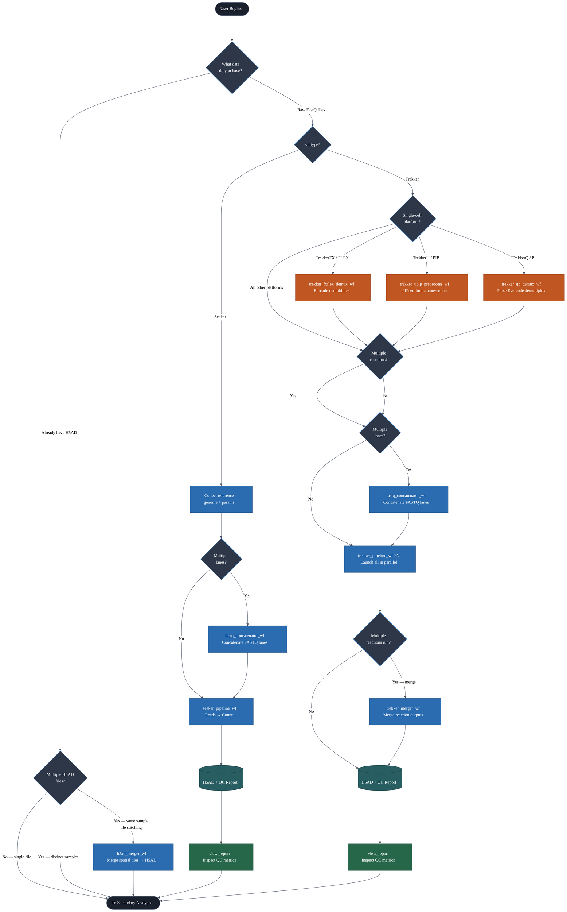

```mermaid
%%{init: {"theme": "neutral", "flowchart": {"rankSpacing": 90, "nodeSpacing": 55, "padding": 24, "wrappingWidth": 220, "useMaxWidth": false}, "themeVariables": {"fontFamily": "Helvetica Neue, Arial, sans-serif", "fontSize": "15px", "lineColor": "#4A5568", "edgeLabelBackground": "#ffffff"}}}%%
flowchart TD
    classDef decision   fill:#2D3748,stroke:#4A90D9,color:#fff
    classDef wf         fill:#2B6CB0,stroke:#2C5282,color:#fff
    classDef step       fill:#276749,stroke:#22543D,color:#fff
    classDef seeker     fill:#6B46C1,stroke:#553C9A,color:#fff
    classDef preprocess fill:#C05621,stroke:#9C4221,color:#fff
    classDef output     fill:#285E61,stroke:#1D4044,color:#fff
    classDef terminal   fill:#1A202C,stroke:#718096,color:#fff

    START([User Begins]):::terminal --> PAQ{What data\ndo you have?}:::decision

    PAQ -->|Raw FastQ files| KIT{Kit type?}:::decision
    PAQ -->|Already have H5AD| MULTI_H5AD{Multiple H5AD\nfiles?}:::decision
    MULTI_H5AD -->|No — single file| SEC_ENTRY
    MULTI_H5AD -->|Yes — same sample\ntile stitching| H5AD_MERGE[h5ad_merger_wf\nMerge spatial tiles → H5AD]:::wf
    MULTI_H5AD -->|Yes — distinct samples| SEC_ENTRY
    H5AD_MERGE --> SEC_ENTRY

    KIT -->|Seeker| SK_GENOME[Collect reference\ngenome + params]:::wf
    SK_GENOME --> SK_LANES{Multiple\nlanes?}:::decision
    SK_LANES -->|Yes| SK_CONCAT[fastq_concatenator_wf\nConcatenate FASTQ lanes]:::wf
    SK_LANES -->|No| SK_WF
    SK_CONCAT --> SK_WF[seeker_pipeline_wf\nReads → Counts]:::wf
    SK_WF --> SK_OUT[(H5AD + QC Report)]:::output
    SK_OUT --> SK_VIEW[view_report\nInspect QC metrics]:::step
    SK_VIEW --> SEC_ENTRY

    KIT -->|Trekker| TK_PLATFORM{Single-cell\nplatform?}:::decision
    TK_PLATFORM -->|TrekkerFX / FLEX| FXFLEX[trekker_fxflex_demux_wf\nBarcode demultiplex]:::preprocess
    TK_PLATFORM -->|TrekkerU / PIP| UPIP[trekker_upip_preprocess_wf\nPIPseq format conversion]:::preprocess
    TK_PLATFORM -->|TrekkerQ / P| QP[trekker_qp_demux_wf\nParse Evercode demultiplex]:::preprocess
    TK_PLATFORM -->|All other platforms| TK_RXNS
    FXFLEX --> TK_RXNS
    UPIP   --> TK_RXNS
    QP     --> TK_RXNS

    TK_RXNS{Multiple\nreactions?}:::decision
    TK_RXNS -->|Yes| TK_LANES
    TK_RXNS -->|No| TK_LANES

    TK_LANES{Multiple\nlanes?}:::decision
    TK_LANES -->|Yes| TK_CONCAT[fastq_concatenator_wf\nConcatenate FASTQ lanes]:::wf
    TK_LANES -->|No| TK_WF
    TK_CONCAT --> TK_WF[trekker_pipeline_wf ×N\nLaunch all in parallel]:::wf

    TK_WF --> TK_MERGE_Q{Multiple\nreactions run?}:::decision
    TK_MERGE_Q -->|Yes — merge| TK_MERGE[trekker_merger_wf\nMerge reaction outputs]:::wf
    TK_MERGE_Q -->|No| TK_OUT
    TK_MERGE --> TK_OUT[(H5AD + QC Report)]:::output
    TK_OUT --> TK_VIEW[view_report\nInspect QC metrics]:::step
    TK_VIEW --> SEC_ENTRY

    SEC_ENTRY([To Secondary Analysis]):::terminal
```
