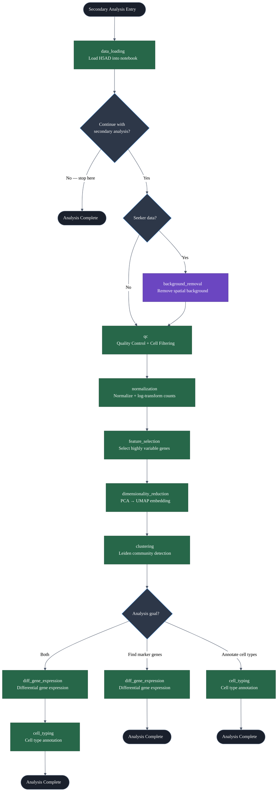

```mermaid
%%{init: {"theme": "neutral", "flowchart": {"rankSpacing": 80, "nodeSpacing": 55, "padding": 24, "wrappingWidth": 240, "useMaxWidth": false}, "themeVariables": {"fontFamily": "Helvetica Neue, Arial, sans-serif", "fontSize": "15px", "lineColor": "#4A5568", "edgeLabelBackground": "#ffffff"}}}%%
flowchart TD
    classDef decision   fill:#2D3748,stroke:#4A90D9,color:#fff
    classDef wf         fill:#2B6CB0,stroke:#2C5282,color:#fff
    classDef step       fill:#276749,stroke:#22543D,color:#fff
    classDef seeker     fill:#6B46C1,stroke:#553C9A,color:#fff
    classDef output     fill:#285E61,stroke:#1D4044,color:#fff
    classDef terminal   fill:#1A202C,stroke:#718096,color:#fff

    SEC_ENTRY([Secondary Analysis Entry]):::terminal
    SEC_ENTRY --> DATA_LOAD[data_loading\nLoad H5AD into notebook]:::step
    DATA_LOAD --> VIZ_Q{Continue with\nsecondary analysis?}:::decision
    VIZ_Q -->|No — stop here| DONE_VIZ([Analysis Complete]):::terminal
    VIZ_Q -->|Yes| SK_Q

    SK_Q{Seeker data?}:::decision
    SK_Q -->|Yes| BG_REM[background_removal\nRemove spatial background]:::seeker
    SK_Q -->|No| QC
    BG_REM --> QC

    QC[qc\nQuality Control + Cell Filtering]:::step
    QC --> NORM[normalization\nNormalize + log-transform counts]:::step
    NORM --> FEAT[feature_selection\nSelect highly variable genes]:::step
    FEAT --> DIMRED[dimensionality_reduction\nPCA → UMAP embedding]:::step
    DIMRED --> CLUST[clustering\nLeiden community detection]:::step

    CLUST --> GOAL{Analysis goal?}:::decision
    GOAL -->|Find marker genes| DGE[diff_gene_expression\nDifferential gene expression]:::step
    GOAL -->|Annotate cell types| CELL[cell_typing\nCell type annotation]:::step
    GOAL -->|Both| DGE2[diff_gene_expression\nDifferential gene expression]:::step
    DGE2 --> CELL2[cell_typing\nCell type annotation]:::step

    DGE   --> DONE1([Analysis Complete]):::terminal
    CELL  --> DONE2([Analysis Complete]):::terminal
    CELL2 --> DONE3([Analysis Complete]):::terminal
```
